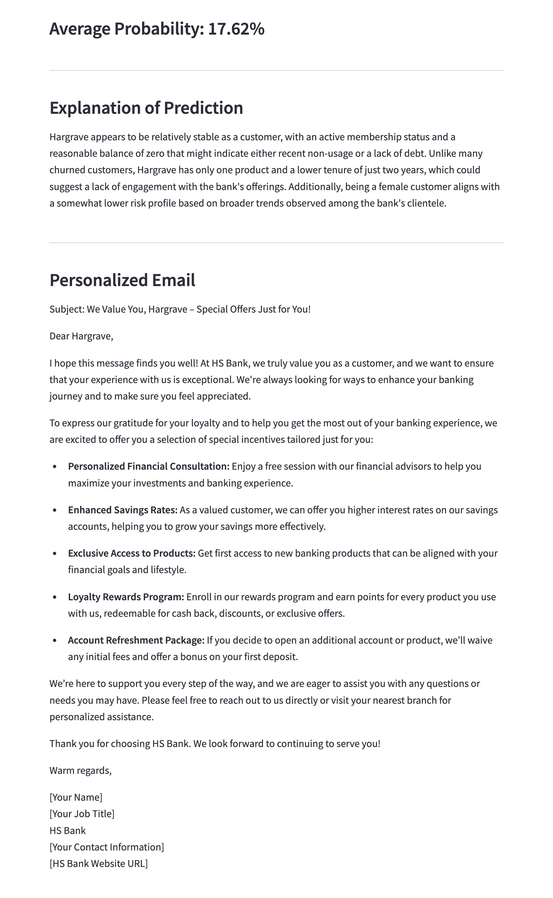
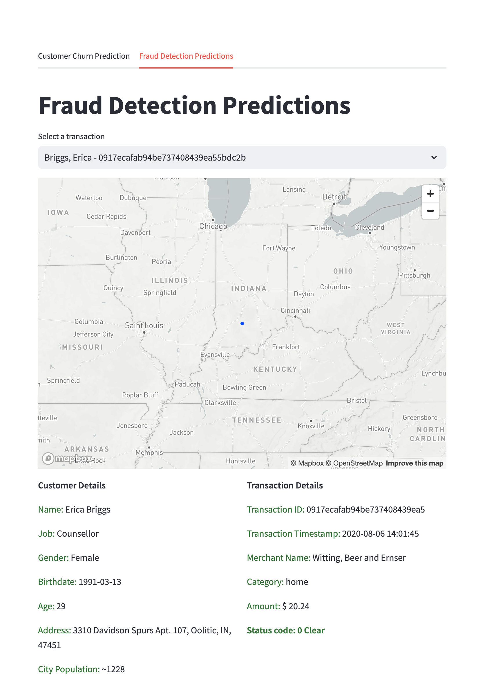
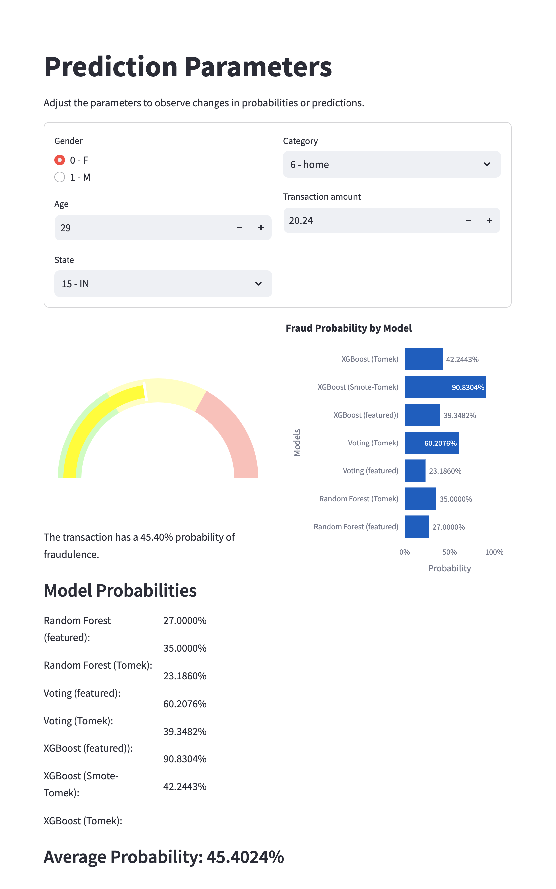
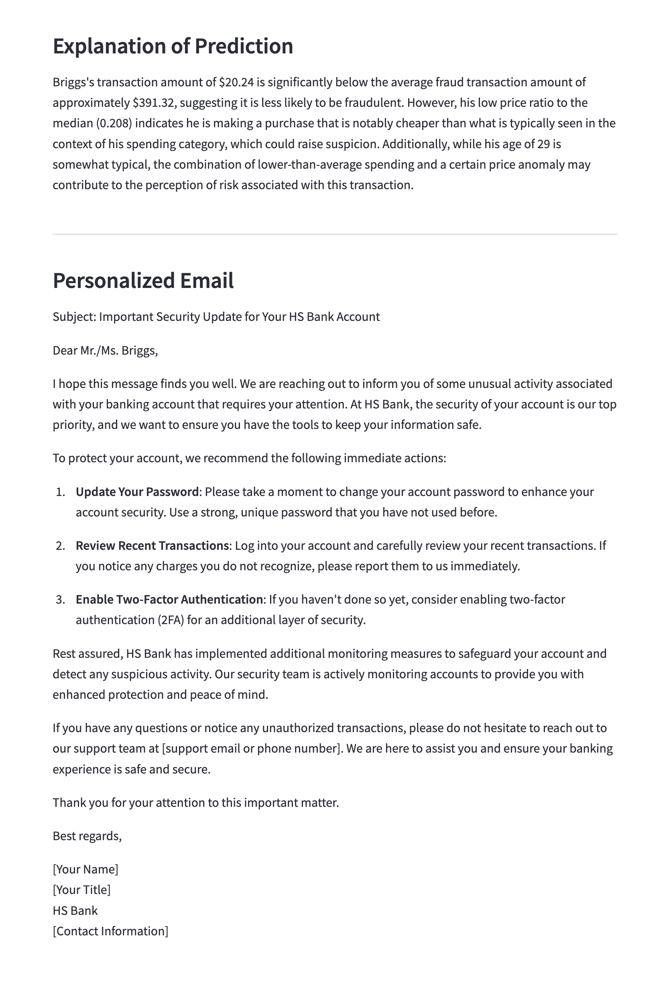

# Customer Churn and Fraud Prediction with Machine Learning

[Demo](https://youtu.be/Mz1d4B9IB4Y)

Description:


Skills: Python, OpenAI, Machine Learning, Model Inference, Feature Engineering, Data Visualization

## Part 1:
* Downloading the dataset
* Understanding the dataset
* Pre-processing the dataset
* Training the ML models
* Evaluating the ML models


## Part 2:
* Building the web app
    * Creating the UI and charts
    * Making predictions with the ML models
    * Generating personalized emails with OpenAI or LLama 3.1 via Groq


    Troubleshooting:
    * Update on storing serialized model and memory snapshots using Pickle
    Use `save_model` instead of `pickle.dump` to save the model
    https://xgboost.readthedocs.io/en/stable/tutorials/saving_model.html







# Challenges
* Large Dataset Handling: Handling large datasets poses memory and performance challenges, including ensuring data integrity when splitting and applying resampling techniques like SMOTE efficiently.
* Preprocessing: Ensuring categorical columns are encoded correctly, especially when consolidating values across multiple DataFrames.
* Model Training and Evaluation: Balancing classes with methods like SMOTE risks adding noise, while training and tuning models on large datasets demands high computational resources. Meaningful model evaluation is also challenging due to class imbalance.
* Version Control and Collaboration: Managing large files in Git requires avoiding GitHub's size limits and configuring Git LFS correctly for collaborative work on large data files.

# Developer's Notes
## Add the git repo:
```bash
git init
git add *
git commit -m 'Initial commit'
git branch -M main
git remote add orgin https://github.com/itancio/<repot>.git
git push -u origin main

## Install required packages
```bash
pip install -r requirements.txt
```

## Create Python virtual environment
```bash
python3 -m venv venv
source venv/bin/activate
```

## Running streamlit
```bash
cd streamlit
streamlit run main.py
```


# Troubleshooting:
* ERROR: The error was related to XGBoost failing to load due to the missing OpenMP runtime library (libomp.dylib) on macOS

SOLUTION: Update ```libomp```
```bash
brew install libomp
```

* ERROR: Rpc failed
```bash
git config --global http.postBuffer 524288000

# Compress commits
git reflog expire --expire=now --all
git gc --prune=now
git repack -A -d
git push origin main
```

OR switch to ssh to avoid HTTP restrictions:

```bash
git remote -v
git remote set-url origin git@github.com:itancio/churn2.git
git push
```

* ERROR: Handling large files
```bash
git lfs install
git lfs track "*.csv"
git add .gitattributes

git add notebook/fraud/fraudTest.csv
git add notebook/fraud/fraudTrain.csv
git commit -m "Add files"
git push origin HEAD:fraud
```